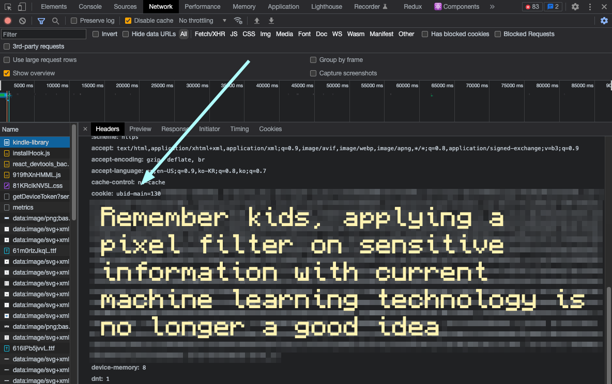
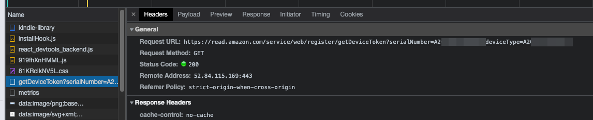

# Kindle-Api

A blazing fast library for Amazon Kindle's private API built without headless browsers.

## Installation

```
yarn add kindle-api
```

## Setup


### Cookies

Amazon's login system is quite strict and the SMS 2FA makes automating logins difficult. Instead of trying to automate that with puppeteer and slow things down, we use 3 cookies that stay valid for an entire year.

- `ubid-main`
- `at-main`
- `session-id`

You can grab these values directly by going on inspect element after loading [read.amazon.com](https://read.amazon.com) and copying the entire thing or just the select ones 

### Device Token

We also need a deviceToken for your kindle. You can grab this from the same network window as before on the `getDeviceToken` request that looks like:

https://read.amazon.com/service/web/register/getDeviceToken?serialNumber=(your-device-token)&deviceType=(your-device-token)



Both of those numbers should be the same.

### Usage

Upon creating the `Kindle` object, you'll load the first batch of books.

```js
import { Kindle } from "kindle-api";

const kindle = await Kindle.fromConfig({
  cookies: "ubid-main=xxx.xxxx ...",
  deviceToken: "(your-device-token)"
});

console.log(kindle.defaultBooks);

/*
[
  KindleBook {
    title: 'Project Hail Mary: A Novel',
    authors: [ { firstName: 'Andy', lastName: 'Weir' } ]
    imageUrl: 'https://m.media-amazon.com/images/I/51YS2zsN+iL._SY400_.jpg',
    asin: 'B08FHBV4ZX',
    originType: 'PURCHASE',
    productUrl: 'https://m.media-amazon.com/images/I/51YS2zsN+iL._SY400_.jpg',
    mangaOrComicAsin: false,
    webReaderUrl: 'https://read.amazon.com/?asin=B08FHBV4ZX'
  },
  KindleBook {
    title: 'Engineering Management for the Rest of Us',
    authors: [ { firstName: 'Sarah', lastName: 'Drasner' } ],
    imageUrl: 'https://m.media-amazon.com/images/I/61xVsTw0gIL._SY400_.jpg',
    asin: 'B0BGYVDX35',
    originType: 'PURCHASE',
    productUrl: 'https://m.media-amazon.com/images/I/61xVsTw0gIL._SY400_.jpg',
    mangaOrComicAsin: false,
    webReaderUrl: 'https://read.amazon.com/?asin=B0BGYVDX35'
  }
]
*/
```

## Book Details

Here's an example of how you could implement a script that keeps track of your book progress

```ts
import { setTimeout } from "node:timers/promises"

// assuming we saved our previous run
const previous = await getPreviousData();

// you can use `await kindle.books()` if you want to re-fetch your book list
for (const book of kindle.defaultBooks) {
  const details = await book.details();

  const readSinceLastTime = details.progress.syncDate > previous.get(details.asin).lastSync;

  if (readSinceLastTime) {
    // make another request to fetch full book details
    // including reading progress
    const fullDetails = await book.fullDetails(details);
    console.log(fullDetails.percentageRead); // 45
  }

  // add a delay after each book lookup to not spam and get banned
  await setTimeout(5000);
}
```

## Important Details

kindle-api works through [cycletls](https://github.com/Danny-Dasilva/CycleTLS) because Amazon uses TLS fingerprinting to detect bots on their kindle website. Because of that, we have to run a webserver locally to allow requests to be done through go instead.

That might cause problems running multiple instances of the library as they will all try to use the same port number.

## Missing features

- [ ] Pagination
- [ ] Reading book content? Can't think of a usecase for this one
- [ ] Basically anything that isn't just getting book info
